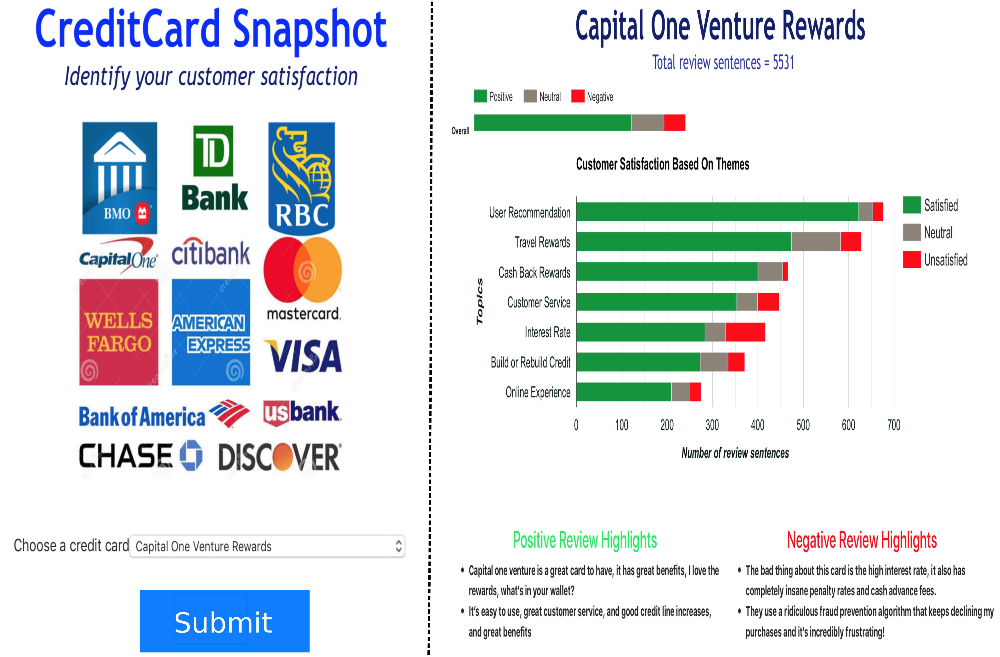
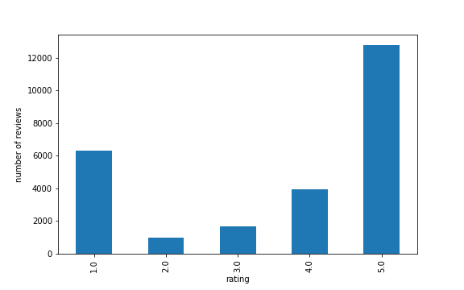
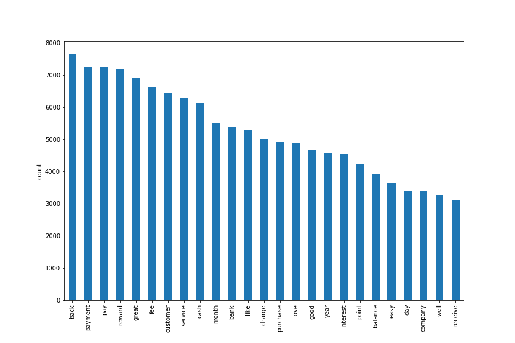
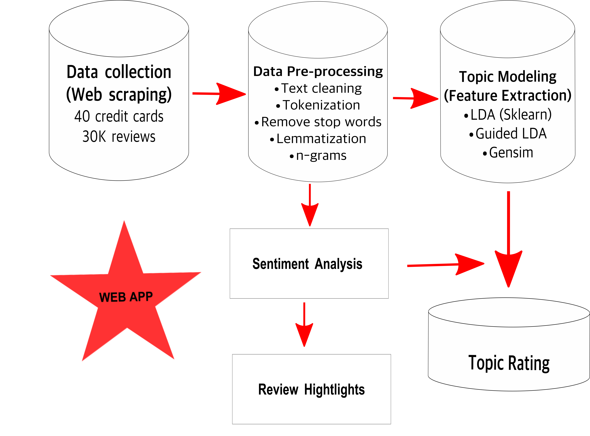
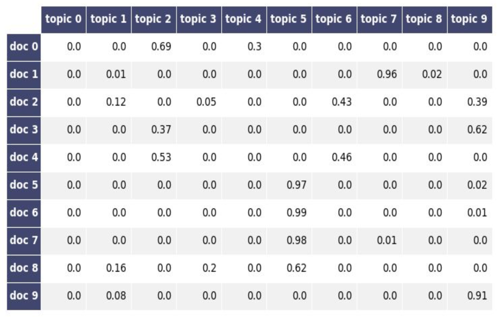
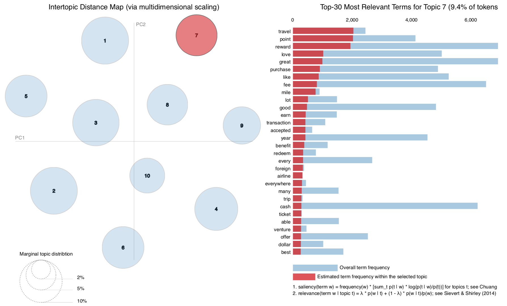

# [CreditCardSnapshot](https://creditcardsnapshot.herokuapp.com/)

##  Overview
The success of every business relies on two basic principles:

1). Customer retention

2). Customer acquisition

 They  are also the major challenges that every business faces.  The credit card companies  face this challenge frequently due to the competition between various credit card companies. Therefore, it is imperative that credit card companies examine their customers' opinion about their product. Indeed, customer satisfaction is a recipe for attracting new customers.  The insight gained from analyzing customer opinions  can be effectively used to develop a custom marketing strategy to positively shift perceptions and attract new customers.    Furthermore, customers also want to entrust their financial future to a reliable credit card company as failure to do so can result in dispute and consequently account closure.   To develop an effective marketing strategy, the company needs to collect feedbacks from customers by conducting online survey of its product or by using online reviews provided by the customers.

## What is [CreditCardSnapshot](https://creditcardsnapshot.herokuapp.com/)?
[CreditCardSnapshot](https://creditcardsnapshot.herokuapp.com/) is a web application that provides an overall customer satisfaction of each credit card (about 40 different cards) based on different categories such as Online Experience, Customer Service, Interest Rate, Cash Back and Reward Points, Travel Rewards, Build or Rebuild Credit, and User Recommendation.  In other words, [CreditCardSnapshot](https://creditcardsnapshot.herokuapp.com/) provides actionable Insights to credit card companies based on customer reviews. Most importantly,  CreditCardSnapshot identifies these categories using unsupervised learning methods of [Natural Language Processing](https://en.wikipedia.org/wiki/Natural_language_processing) and [Topic Modeling](https://en.wikipedia.org/wiki/Topic_model) with [Latent Dirichlet Allocation](https://en.wikipedia.org/wiki/Latent_Dirichlet_allocation).

## Why [CreditCardSnapshot](https://creditcardsnapshot.herokuapp.com/)?
[CreditCardSnapshot](https://creditcardsnapshot.herokuapp.com/) aims to help credit companies acquire new customers by showcasing the rate of customer satisfaction in different categories, which a potential customer cannot extract by reading thousands of online reviews. Essentially, any credit card company can use CreditCardSnapshot as an advertisement web application to attract new customers to apply for its credit card. In addition, CreditCardSnapshot also helps credit card companies identify area of interest that needs improvement, which helps maximize their chances of acquiring new customers.  In contrast, potential customers can also use CreditCardSnapshot to filter out different credit card they don't like.

## How to use [CreditCardSnapshot](https://creditcardsnapshot.herokuapp.com/)
[CreditCardSnapshot](https://creditcardsnapshot.herokuapp.com/) has a drop-down menu of 40 credit cards. The user (either a credit company or a potential customer) can choose any credit card and hit the submit button, which opens the result page.

## What type of data was used for [CreditCardSnapshot](https://creditcardsnapshot.herokuapp.com/)?
The data that was used to create [CreditCardSnapshot](https://creditcardsnapshot.herokuapp.com/) was collected from three different websites using web scraping.

1). [Wallet Hub](https://wallethub.com)

2). [Consumer Affairs](https://www.consumeraffairs.com)

3). [Influenster](https://www.influenster.com)

The dataset comprises 40 different credit cards with over 30k unstructured text reviews.

## Exploratory data analysis  for [CreditCardSnapshot](https://creditcardsnapshot.herokuapp.com/)

To explore my data, I looked at the  star rating customers gave to each credit card as shown below.

We can see that there is a severe imbalance in the rating as most customer reviews were rated either 5 or 1.

In addition, I also looked at the most frequent words customers used in credit reviews. From the figure shown below, we can see that cash back, reward, payment, fee, and customer service are frequently used.

 This also suggests that we need to add [n-gram](https://en.wikipedia.org/wiki/N-gram) when modeling the topics

## How was [CreditCardSnapshot](https://creditcardsnapshot.herokuapp.com/) implemented?
[CreditCardSnapshot](https://creditcardsnapshot.herokuapp.com/) was implemented using unsupervised learning methods for natural language processing in Python, topic modeling with LDA, and sentiment analysis using VADER and TextBlob.  The NLP pipeline for this project is depicted below.

## How was [CreditCardSnapshot](https://creditcardsnapshot.herokuapp.com/) validated?

The validation was based on the document-topic matrix shown below. It shows the probability distribution that a topic belongs to a document. We assigned a topic to a document if its probability of belonging to that document is greater than 0.7. This ensures that the topic clearly describes the document it is assigned to.

As we can see above, the document-topic matrix contains a lot of zeros which means that the topics are clearly separated as corroborated  by the topic distributions shown below.

## Summary and Outlook
[CreditCardSnapshot](https://creditcardsnapshot.herokuapp.com/) is a project I did as an Insight Fellow. The main goal of this project is to help credit companies acquire new customers and also help potential customers find a reliable credit card company.  Currently, [CreditCardSnapshot](https://creditcardsnapshot.herokuapp.com/) contains almost all the major credit card companies and few unpopular ones, and the web app runs based on the most recent reviews at the time this project was conducted. In the future, I would like [CreditCardSnapshot](https://creditcardsnapshot.herokuapp.com/) to update in real time by streaming data from different review platforms.
