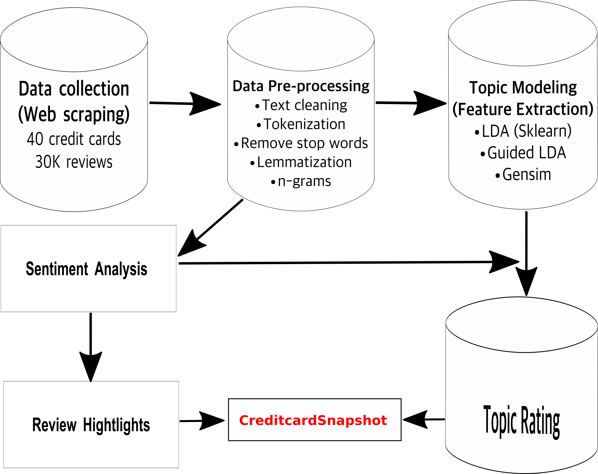

# CREDITCARD SNAPSHOT

## Problem Statement
The success of every business follows two basic principles:  
1). Retain existing customers

2).  Acquire new customers.
This is easier said than done because customer satisfaction is a major challenge that every business faces.  The credit card companies seriously face this challenge due to the competition among them. Therefore, it is imperative that credit card companies examine their customers' opinion about their product. Indeed, customer satisfaction is a recipe for attracting new customers.  The insight gained from analyzing customer opinions  can be effectively used to  develop a custom marketing strategy to positively shift perceptions and attract new customers.   Furthermore, customers also want to entrust their financial future to a reliable credit card company as failure to do so can result in dispute and consequently account closure.  Many businesses tackle these problems in different ways, for instance by conducting online survey or using online reviews of their product provided by the customers. In this project, I undertook this challenge using [Natural Language Processing](https://en.wikipedia.org/wiki/Natural_language_processing) and [Machine Learning](https://en.wikipedia.org/wiki/Machine_learning) techniques.

## Data Collection
The data I used for this project was collected from three different websites listed below using web scraping.

1). [Wallet Hub](https://wallethub.com)

2). [Consumer Affairs](https://www.consumeraffairs.com)

3). [Influenster](https://www.influenster.com)

The dataset comprises 40 different credit cards with over 30k reviews.

## Proposed Solution

The major challenge in this project is to identify the main topics (themes) from unstructured text data and rate the topics based on sentiment. Using this result, credit card companies can identify the specific areas to focus their attention on in order to maximize their customer satisfaction and attract new customers. The NLP pipeline for this project is depicted below.

